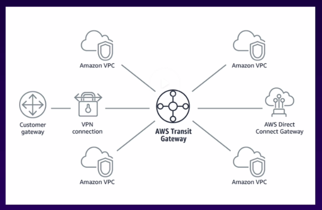

# 1.1 Design a multi-tier architecture solution

* [Amazon Viritual Private Cloud (VPC)](vpc)

* [AWS Site-to-Site VPN](site-to-site-vpn)

**note:** Multi-Account Direct Connect for accounts in same Organization.

> A transit gateway is a network transit hub that you can use to interconnect your virtual private clouds (VPC) and on-premises networks.

-AWS-[What is a transit gateway?](https://docs.aws.amazon.com/vpc/latest/tgw/what-is-transit-gateway.html)

AWS Global Accelerator is a service in which you create accelerators to improve availability and performance of your applications for local and global users. Global Accelerator directs traffic to optimal endpoints over the AWS global network. This improves the availability and performance of your internet applications that are used by a global audience.

AWS Global Accelerator provides you with a set of static IP addresses that are anycast from the AWS edge network. If you bring your own IP address range to AWS (BYOIP), you can instead assign static IP addresses from your own pool to use with your accelerator.

The static IP addresses serve as single fixed entry points for your clients. When you set up your accelerator with Global Accelerator, you associate your static IP addresses to regional endpoints—Network Load Balancers, Application Load Balancers, Amazon EC2 instances, or Elastic IP addresses—in one or more AWS Regions. The static IP addresses accept incoming traffic onto the AWS global network from the edge location that is closest to your users.