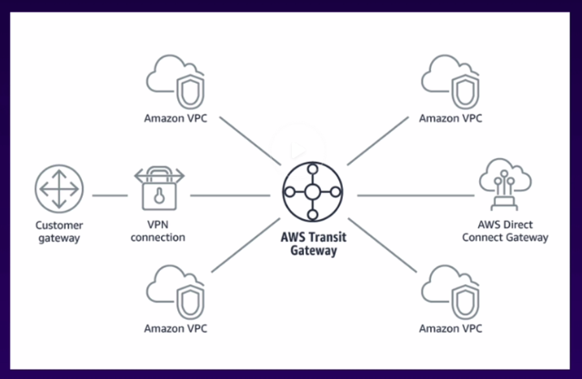

# Amazon Virtual Private Cloud (VPC)

## Concepts

### Overview

> Amazon Virtual Private Cloud (Amazon VPC) enables you to launch AWS resources into a virtual network that you've defined. This virtual network closely resembles a traditional network that you'd operate in your own data center, with the benefits of using the scalable infrastructure of AWS.

-AWS-[What is Amazon VPC?](https://docs.aws.amazon.com/vpc/latest/userguide/what-is-amazon-vpc.html)

**note:** A Cloud Guru, 5 reserved IP addresses per subnet.

**note:** NAT GW does not support IPV6 where-as IG does.

### Default VPC

### Public / Private VPC

### Misc

> VPC Flow Logs is a feature that enables you to capture information about the IP traffic going to and from network interfaces in your VPC. Flow log data can be published to Amazon CloudWatch Logs or Amazon S3.

-AWS-[VPC Flow logs](https://docs.aws.amazon.com/vpc/latest/userguide/flow-logs.html)

**note:** A Cloud Guru, can be captured at VPC, Subnet, or ENI

**note:** Can filter by Rejected, Accepted, or All traffic

**note:** Not all traffic is logged, e.g., DNS to AWS not, Windows activation, or MetaData API, DHCP

-AWS-[What is AWS Direct Connect?](https://docs.aws.amazon.com/directconnect/latest/UserGuide/Welcome.html)

> A VPC endpoint enables you to privately connect your VPC to supported AWS services and VPC endpoint services powered by AWS PrivateLink without requiring an internet gateway, NAT device, VPN connection, or AWS Direct Connect connection. Instances in your VPC do not require public IP addresses to communicate with resources in the service. Traffic between your VPC and the other service does not leave the Amazon network.

&nbsp;

> Endpoints are virtual devices. They are horizontally scaled, redundant, and highly available VPC components. They allow communication between instances in your VPC and services without imposing availability risks or bandwidth constraints on your network traffic.

&nbsp;

> There are two types of VPC endpoints: interface endpoints and gateway endpoints. Create the type of VPC endpoint required by the supported service.

**note:** A Cloud Guru, S3 and DynamoDB using GW endpoint

**note:** GW endpoint modifies route table

-AWS-[VPC endpoints](https://docs.aws.amazon.com/vpc/latest/userguide/vpc-endpoints.html)

**note:** GW Endpoints are free and interface endpoints are not. Thinking much like why IG is free and NAT GW is not; second requires compute.

> A bastion host is a special-purpose computer on a network specifically designed and configured to withstand attacks. The computer generally hosts a single application, for example a proxy server, and all other services are removed or limited to reduce the threat to the computer. It is hardened in this manner primarily due to its location and purpose, which is either on the outside of a firewall or in a demilitarized zone (DMZ) and usually involves access from untrusted networks or computers.

-Wikipedia

**note:** A Cloud Guru.  Two options for HA Bastion

Option 2 requires script to take over the EIP address.

> AWS Global Accelerator is a service in which you create accelerators to improve availability and performance of your applications for local and global users. Global Accelerator directs traffic to optimal endpoints over the AWS global network. This improves the availability and performance of your internet applications that are used by a global audience. Global Accelerator is a global service that supports endpoints in multiple AWS Regions, which are listed in the AWS Region Table.

&nbsp;

> By default, Global Accelerator provides you with two static IP addresses that you associate with your accelerator. (Or, instead of using the IP addresses that Global Accelerator provides, you can configure these entry points to be IPv4 addresses from your own IP address ranges that you bring to Global Accelerator.) The static IP addresses are anycast from the AWS edge network and distribute incoming application traffic across multiple endpoint resources in multiple AWS Regions, which increases the availability of your applications. Endpoints can be Network Load Balancers, Application Load Balancers, Amazon EC2 instances, or Elastic IP addresses that are located in one AWS Region or multiple Regions.

-AWS-[What is AWS Global Accelerator?](https://docs.aws.amazon.com/global-accelerator/latest/dg/what-is-global-accelerator.html)

> The static IP addresses accept incoming traffic onto the AWS global network from the edge location that is closest to your users.

-AWS-[How AWS Global Accelerator works](https://docs.aws.amazon.com/global-accelerator/latest/dg/introduction-how-it-works.html)

> Static IP addresses: Global Accelerator provides you with a set of two static IP addresses that are anycast from the AWS edge network. If you bring your own IP address range to AWS (BYOIP), you can instead assign IP addresses from your own pool to use with your accelerator.

&nbsp;

> Accelerator: An accelerator directs traffic to optimal endpoints over the AWS global network to improve the availability and performance of your internet applications.

&nbsp;

> DNS name: Global Accelerator assigns each accelerator a default Domain Name System (DNS) name, similar to a1234567890abcdef.awsglobalaccelerator.com, that points to the static IP addresses... or set up DNS records to route traffic using your own custom domain name.

&nbsp;

> Network zone: A network zone services the static IP addresses for your accelerator from a unique IP subnet. Similar to an AWS Availability Zone, a network zone is an isolated unit with its own set of physical infrastructure... If one IP address from a network zone becomes unavailable due to IP address blocking by certain client networks, or network disruptions, then client applications can retry on the healthy static IP address from the other isolated network zone.

&nbsp;

> Listener: A listener processes inbound connections from clients to Global Accelerator, based on the port (or port range) and protocol that you configure... Each listener has one or more endpoint groups associated with it, and traffic is forwarded to endpoints in one of the groups.

**note:** A Cloud Guru, Can enable client affinity; like sticky sessions.

**note:** A Cloud Guru, Can have health check.

> Endpoint group: Each endpoint group is associated with a specific AWS Region. Endpoint groups include one or more endpoints in the Region.

**note:** A Cloud Guru, Can be weighted "dial"

> Endpoint: Endpoints can be Network Load Balancers, Application Load Balancers, EC2 instances, or Elastic IP addresses. An Application Load Balancer endpoint can be an internet-facing or internal.

**note:** A Cloud Guru, Can be weighted "weight"

-AWS-[AWS Global Accelerator components](https://docs.aws.amazon.com/global-accelerator/latest/dg/introduction-components.html)

> AWS PrivateLink enables you to connect to some AWS services, services hosted by other AWS accounts (referred to as endpoint services), and supported AWS Marketplace partner services, via private IP addresses in your VPC. The interface endpoints are created directly inside of your VPC, using elastic network interfaces and IP addresses in your VPC’s subnets. That means that VPC Security Groups can be used to manage access to the endpoints.

-AWS-[AWS PrivateLink](https://docs.aws.amazon.com/whitepapers/latest/aws-vpc-connectivity-options/aws-privatelink.html)

> A transit gateway is a network transit hub that you can use to interconnect your virtual private clouds (VPC) and on-premises networks.

-AWS-[What is a transit gateway?](https://docs.aws.amazon.com/vpc/latest/tgw/what-is-transit-gateway.html)

> By default, instances that you launch into an Amazon VPC can't communicate with your own (remote) network. You can enable access to your remote network from your VPC by creating an AWS Site-to-Site VPN (Site-to-Site VPN) connection, and configuring routing to pass traffic through the connection.

-AWS-[What is AWS Site-to-Site VPN?](https://docs.aws.amazon.com/vpn/latest/s2svpn/VPC_VPN.html)

> Building on the AWS managed VPN options described previously, you can securely communicate from one site to another using the AWS VPN CloudHub. The AWS VPN CloudHub operates on a simple hub-and-spoke model that you can use with or without a VPC. Use this approach if you have multiple branch offices and existing internet connections and would like to implement a convenient, potentially low-cost hub-and-spoke model for primary or backup connectivity between these remote offices.

-AWS-[AWS VPN CloudHub](https://docs.aws.amazon.com/whitepapers/latest/aws-vpc-connectivity-options/aws-vpn-cloudhub.html)

## Exercises

### Review Elements of Default VPC

1. VPC: Region and CIDR

2. Internet Gateway

3. Subnet: AZ and CIDR

4. Route Table: Subnet and routes (Public)

5. Network Access Control List (NACL): Stateless firewall, Subnet, and IB and OB rules

6. Security Group: Stateful firewall, VPC, and IB and OB rules

### Create VPC with Public and Private Subnets

1. Create VPC with public and private

#### Supplemental Tasks

1. Tear out
