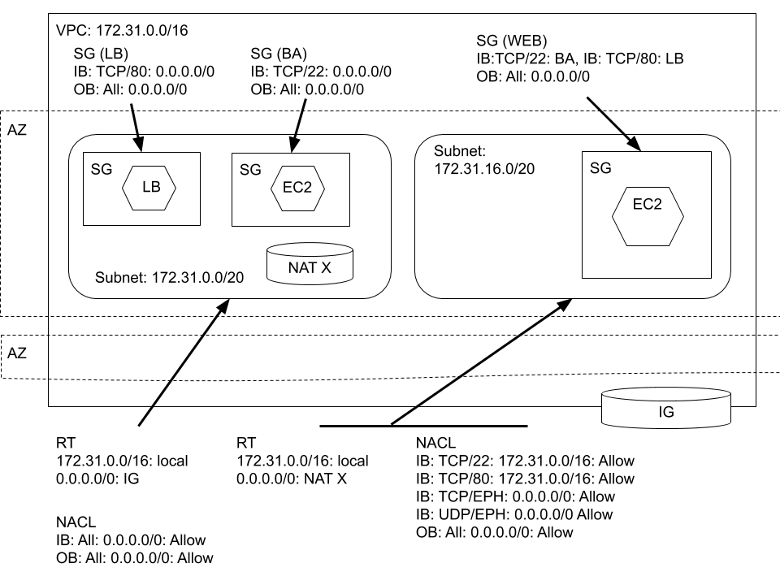
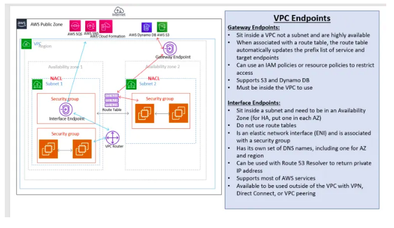
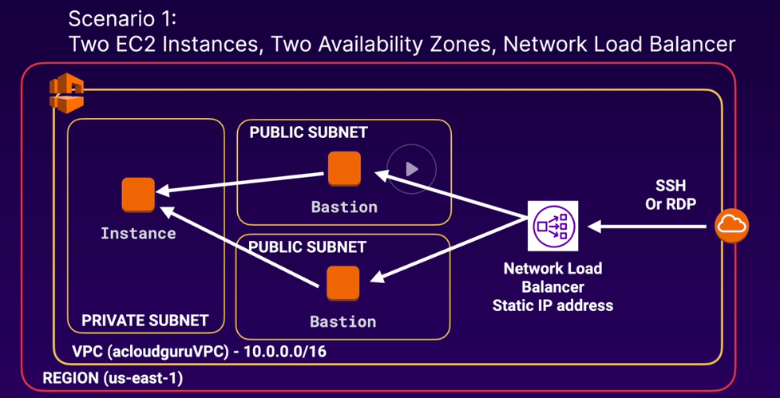
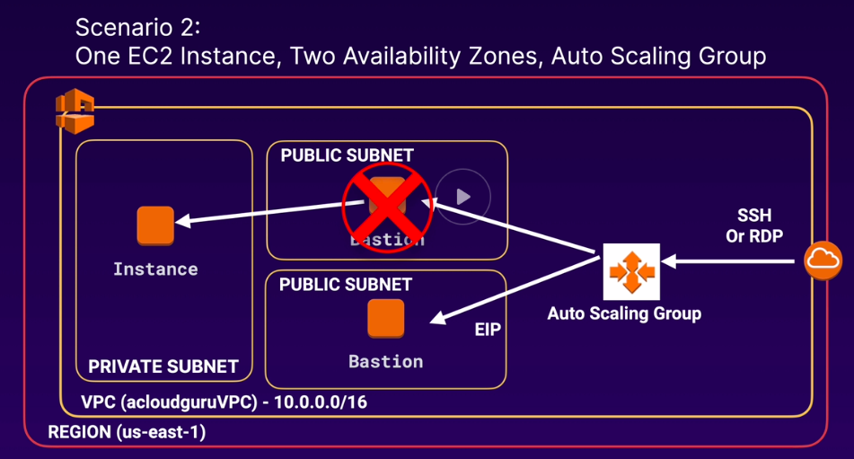
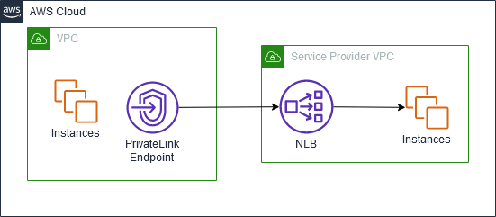
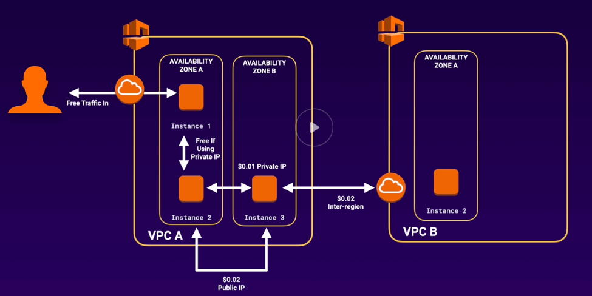

# Amazon Virtual Private Cloud (VPC)

## Concepts

### Overview

> Amazon Virtual Private Cloud (Amazon VPC) enables you to launch AWS resources into a virtual network that you've defined. This virtual network closely resembles a traditional network that you'd operate in your own data center, with the benefits of using the scalable infrastructure of AWS.

-AWS-[What is Amazon VPC?](https://docs.aws.amazon.com/vpc/latest/userguide/what-is-amazon-vpc.html)

**note:** A Cloud Guru, 5 reserved IP addresses per subnet. 1, Network, 2 Router, 3, DNS, 4 Future, Last: Broadcast

**note:** NAT GW does not support IPV6 where-as IG does.

**note:** Each Account has own notion of AZ.

### Default VPC

### Public / Private VPC

### NAT

You can use a NAT device to enable instances in a private subnet to connect to the internet (for example, for software updates) or other AWS services, but prevent the internet from initiating connections with the instances.

AWS offers two kinds of NAT devices—a NAT gateway or a NAT instance. We recommend NAT gateways, as they provide better availability and bandwidth over NAT instances. The NAT Gateway service is also a managed service that does not require your administration efforts. A NAT instance is launched from a NAT AMI. You can choose to use a NAT instance for special purposes.

Each EC2 instance performs source/destination checks by default. This means that the instance must be the source or destination of any traffic it sends or receives. However, a NAT instance must be able to send and receive traffic when the source or destination is not itself. Therefore, you must disable source/destination checks on the NAT instance.

### Misc

OSI Model: Please Do Not Throw Sausage Pizza Away

AWS No Support Multicast (L2 feature)

TCP / UDP / ICMP

Ports; Well Known and Ephemeral

> VPC Flow Logs is a feature that enables you to capture information about the IP traffic going to and from network interfaces in your VPC. Flow log data can be published to Amazon CloudWatch Logs or Amazon S3.

-AWS-[VPC Flow logs](https://docs.aws.amazon.com/vpc/latest/userguide/flow-logs.html)

**note:** A Cloud Guru, can be captured at VPC, Subnet, or ENI

**note:** Can filter by Rejected, Accepted, or All traffic

**note:** Not all traffic is logged, e.g., DNS to AWS not, Windows activation, or MetaData API, DHCP

> A VPC endpoint enables you to privately connect your VPC to supported AWS services and VPC endpoint services powered by AWS PrivateLink without requiring an internet gateway, NAT device, VPN connection, or AWS Direct Connect connection. Instances in your VPC do not require public IP addresses to communicate with resources in the service. Traffic between your VPC and the other service does not leave the Amazon network.

&nbsp;

> Endpoints are virtual devices. They are horizontally scaled, redundant, and highly available VPC components. They allow communication between instances in your VPC and services without imposing availability risks or bandwidth constraints on your network traffic.

&nbsp;

> There are two types of VPC endpoints: interface endpoints and gateway endpoints. Create the type of VPC endpoint required by the supported service.

**note:** A Cloud Guru, S3 and DynamoDB using GW endpoint

**note:** GW endpoint modifies route table

-AWS-[VPC endpoints](https://docs.aws.amazon.com/vpc/latest/userguide/vpc-endpoints.html)

**note:** GW Endpoints are free and interface endpoints are not. Thinking much like why IG is free and NAT GW is not; second requires compute.

> A bastion host is a special-purpose computer on a network specifically designed and configured to withstand attacks. The computer generally hosts a single application, for example a proxy server, and all other services are removed or limited to reduce the threat to the computer. It is hardened in this manner primarily due to its location and purpose, which is either on the outside of a firewall or in a demilitarized zone (DMZ) and usually involves access from untrusted networks or computers.

-Wikipedia

**note:** A Cloud Guru.  Two options for HA Bastion

Option 2 requires script to take over the EIP address.

> AWS PrivateLink enables you to connect to some AWS services, services hosted by other AWS accounts (referred to as endpoint services), and supported AWS Marketplace partner services, via private IP addresses in your VPC. The interface endpoints are created directly inside of your VPC, using elastic network interfaces and IP addresses in your VPC’s subnets. That means that VPC Security Groups can be used to manage access to the endpoints.

-AWS-[AWS PrivateLink](https://docs.aws.amazon.com/whitepapers/latest/aws-vpc-connectivity-options/aws-privatelink.html)

> A VPC peering connection is a networking connection between two VPCs that enables you to route traffic between them using private IPv4 addresses or IPv6 addresses. Instances in either VPC can communicate with each other as if they are within the same network. You can create a VPC peering connection between your own VPCs, or with a VPC in another AWS account. The VPCs can be in different regions (also known as an inter-region VPC peering connection).

## Exercises

### Review Elements of Default VPC

1. VPC: Region and CIDR

2. Internet Gateway

3. Subnet: AZ and CIDR

4. Route Table: Subnet and routes (Public)

5. Network Access Control List (NACL): Stateless firewall, Subnet, and IB and OB rules

6. Security Group: Stateful firewall, VPC, and IB and OB rules

### Create VPC with Public and Private Subnets

1. Create VPC with public and private

#### Supplemental Tasks

1. Tear out
