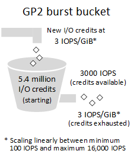
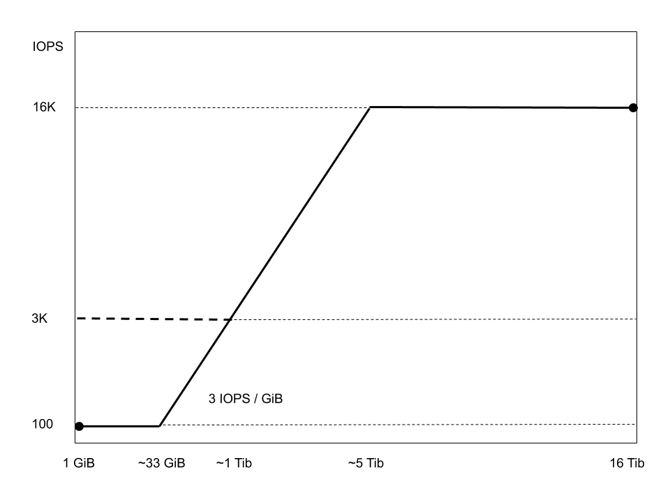
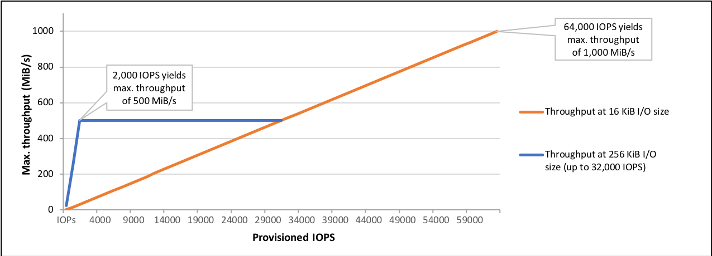
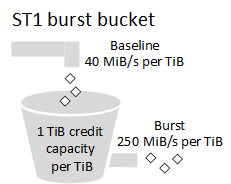
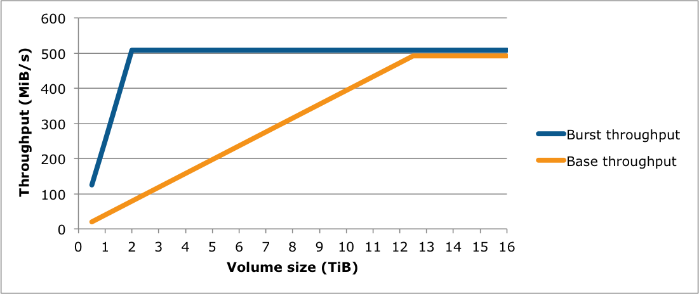
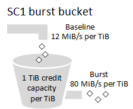
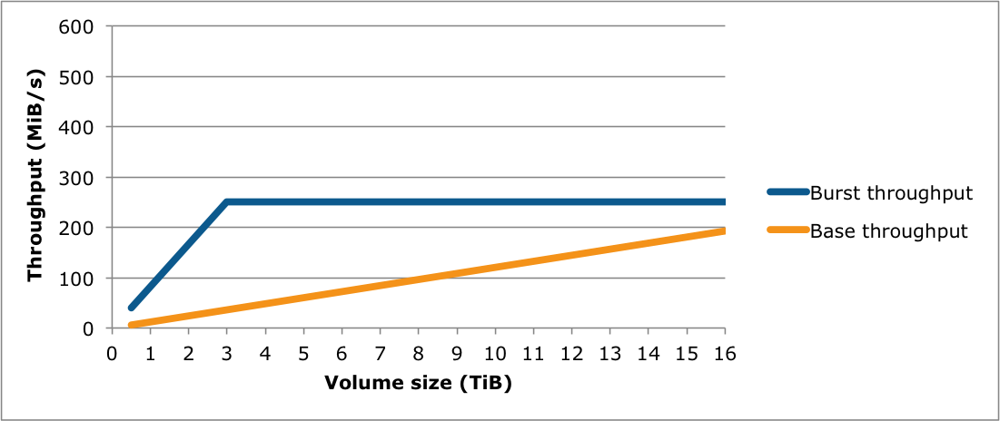

# Amazon Elastic Block Store (EBS)

## Concepts

### Overview

> Amazon Elastic Block Store (Amazon EBS) provides block level storage volumes for use with EC2 instances. EBS volumes behave like raw, unformatted block devices. You can mount these volumes as devices on your instances. EBS volumes that are attached to an instance are exposed as storage volumes that persist independently from the life of the instance. You can create a file system on top of these volumes, or use them in any way you would use a block device (such as a hard drive). You can dynamically change the configuration of a volume attached to an instance.

&nbsp;

> EBS volumes are created in a specific Availability Zone, and can then be attached to any instances in that same Availability Zone. To make a volume available outside of the Availability Zone, you can create a snapshot and restore that snapshot to a new volume anywhere in that Region. You can copy snapshots to other Regions and then restore them to new volumes there, making it easier to leverage multiple AWS Regions for geographical expansion, data center migration, and disaster recovery.

&nbsp;

> General Purpose SSD volumes offer a base performance of 3 IOPS/GiB, with the ability to burst to 3,000 IOPS for extended periods of time. These volumes are ideal for a broad range of use cases such as boot volumes, small and medium-size databases, and development and test environments.

&nbsp;

> Provisioned IOPS SSD volumes support up to 64,000 IOPS and 1,000 MiB/s of throughput. This allows you to predictably scale to tens of thousands of IOPS per EC2 instance.

&nbsp;

> Throughput Optimized HDD volumes provide low-cost magnetic storage that defines performance in terms of throughput rather than IOPS. These volumes are ideal for large, sequential workloads such as Amazon EMR, ETL, data warehouses, and log processing.

&nbsp;

> Cold HDD volumes provide low-cost magnetic storage that defines performance in terms of throughput rather than IOPS. These volumes are ideal for large, sequential, cold-data workloads. If you require infrequent access to your data and are looking to save costs, these volumes provides inexpensive block storage.

-AWS-[Amazon Elastic Block Store (Amazon EBS)](https://docs.aws.amazon.com/AWSEC2/latest/UserGuide/AmazonEBS.html)

> Amazon EBS volumes are placed in a specific Availability Zone where they are automatically replicated to protect you from the failure of a single component. All EBS volume types offer durable snapshot capabilities and are designed for 99.999% availability.

-AWS-[Amazon EBS features](https://aws.amazon.com/ebs/features/)

> EBS Magnetic volumes are backed by hard disk drives (HDDs) and can be used for workloads with smaller datasets where data is accessed infrequently or when performance consistency isn't of primary importance. EBS Magnetic volumes provide approximately 100 IOPS on average, with an ability to burst to hundreds of IOPS, and support volumes from 1GB to 1TB in size.

-AWS-[Amazon EBS previous generation volumes](https://aws.amazon.com/ebs/previous-generation/)

> An Amazon EBS volume is a durable, block-level storage device that you can attach to your instances. After you attach a volume to an instance, you can use it as you would use a physical hard drive. EBS volumes are flexible. For current-generation volumes attached to current-generation instance types, you can dynamically increase size, modify the provisioned IOPS capacity, and change volume type on live production volumes.

&nbsp;

> You can attach multiple EBS volumes to a single instance. The volume and instance must be in the same Availability Zone. Depending on the volume and instance types, you can use Multi-Attach to mount a volume to multiple instances at the same time.

-AWS-[Amazon EBS volumes](https://docs.aws.amazon.com/AWSEC2/latest/UserGuide/ebs-volumes.html)

> After you attach an Amazon EBS volume to your instance, it is exposed as a block device. You can format the volume with any file system and then mount it. After you make the EBS volume available for use, you can access it in the same ways that you access any other volume. Any data written to this file system is written to the EBS volume and is transparent to applications using the device.

-AWS-[Making an Amazon EBS volume available for use on Linux](https://docs.aws.amazon.com/AWSEC2/latest/UserGuide/ebs-using-volumes.html)

> Max IOPS per instance 80,000

&nbsp;

> To achieve this throughput, you must have an instance that supports EBS optimization.

-AWS-[Amazon EBS volume types](https://docs.aws.amazon.com/AWSEC2/latest/WindowsGuide/ebs-volume-types.html)

> With Amazon EBS, you can use any of the standard RAID configurations that you can use with a traditional bare metal server, as long as that particular RAID configuration is supported by the operating system for your instance. This is because all RAID is accomplished at the software level. For greater I/O performance than you can achieve with a single volume, RAID 0 can stripe multiple volumes together; for on-instance redundancy, RAID 1 can mirror two volumes together.

&nbsp;

> To create a consistent set of snapshots for your RAID array, use EBS multi-volume snapshots. Multi-volume snapshots allow you to take point-in-time, data coordinated, and crash-consistent snapshots across multiple EBS volumes attached to an EC2 instance. You do not have to stop your instance to coordinate between volumes to ensure consistency because snapshots are automatically taken across multiple EBS volumes.

-AWS-[RAID Configuration on Linux](https://docs.aws.amazon.com/AWSEC2/latest/UserGuide/raid-config.html)

### Operations

> You can back up the data on your Amazon EBS volumes to Amazon S3 by taking point-in-time snapshots. Snapshots are incremental backups, which means that only the blocks on the device that have changed after your most recent snapshot are saved. This minimizes the time required to create the snapshot and saves on storage costs by not duplicating data. When you delete a snapshot, only the data unique to that snapshot is removed. Each snapshot contains all of the information that is needed to restore your data (from the moment when the snapshot was taken) to a new EBS volume.

-AWS-[Amazon EBS snapshots](https://docs.aws.amazon.com/AWSEC2/latest/UserGuide/EBSSnapshots.html)

> After you increase the size of an EBS volume, you must use file system–specific commands to extend the file system to the larger size. You can resize the file system as soon as the volume enters the optimizing state.

&nbsp;

> Before extending a file system that contains valuable data, it is best practice to create a snapshot of the volume, in case you need to roll back your changes

-AWS-[Extending a Linux file system after resizing a volume](https://docs.aws.amazon.com/AWSEC2/latest/UserGuide/recognize-expanded-volume-linux.html)

### Encryption

> Amazon EBS encryption offers a straight-forward encryption solution for your EBS resources that doesn't require you to build, maintain, and secure your own key management infrastructure. It uses AWS Key Management Service (AWS KMS) customer master keys (CMK) when creating encrypted volumes and snapshots.

&nbsp;

> Encryption operations occur on the servers that host EC2 instances, ensuring the security of both data-at-rest and data-in-transit between an instance and its attached EBS storage.

&nbsp;

> When you create a new, empty EBS volume, you can encrypt it by enabling encryption for the specific volume creation operation. If you enabled EBS encryption by default, the volume is automatically encrypted.

&nbsp;

> Although there is no direct way to encrypt an existing unencrypted volume or snapshot, you can encrypt them by creating either a volume or a snapshot.

-AWS-[Amazon EBS encryption](https://docs.aws.amazon.com/AWSEC2/latest/WindowsGuide/EBSEncryption.html)

### GP2 Performance Characteristics

> General Purpose SSD (gp2) volumes offer cost-effective storage that is ideal for a broad range of workloads. These volumes deliver single-digit millisecond latencies and the ability to burst to 3,000 IOPS for extended periods of time. Between a minimum of 100 IOPS (at 33.33 GiB and below) and a maximum of 16,000 IOPS (at 5,334 GiB and above), baseline performance scales linearly at 3 IOPS per GiB of volume size. AWS designs gp2 volumes to deliver their provisioned performance 99% of the time. A gp2 volume can range in size from 1 GiB to 16 TiB.

&nbsp;

> The performance of gp2 volumes is tied to volume size, which determines the baseline performance level of the volume and how quickly it accumulates I/O credits; larger volumes have higher baseline performance levels and accumulate I/O credits faster. I/O credits represent the available bandwidth that your gp2 volume can use to burst large amounts of I/O when more than the baseline performance is needed. The more credits your volume has for I/O, the more time it can burst beyond its baseline performance level and the better it performs when more performance is needed.

> For example, a 100 GiB gp2 volume with an empty credit balance has a baseline performance of 300 IOPS and a throughput limit of 75 MiB/s (300 I/O operations per second * 256 KiB per I/O operation = 75 MiB/s).

&nbsp;

> The throughput limit is between 128 MiB/s and 250 MiB/s, depending on the volume size. Volumes smaller than 170 GiB deliver a maximum throughput of 128 MiB/s. Volumes larger than 170 GiB but smaller than 334 GiB deliver a maximum throughput of 250 MiB/s if burst credits are available.

-AWS-[Amazon EBS volume types](https://docs.aws.amazon.com/AWSEC2/latest/WindowsGuide/ebs-volume-types.html)

### IO1 Performance Characteristics

> An io1 volume can range in size from 4 GiB to 16 TiB. You can provision from 100 IOPS up to 64,000 IOPS per volume on Instances built on the Nitro System and up to 32,000 on other instances. The maximum ratio of provisioned IOPS to requested volume size (in GiB) is 50:1. For example, a 100 GiB volume can be provisioned with up to 5,000 IOPS. On a supported instance type, any volume 1,280 GiB in size or greater allows provisioning up to the 64,000 IOPS maximum (50 × 1,280 GiB = 64,000).

&nbsp;

> An io1 volume provisioned with up to 32,000 IOPS supports a maximum I/O size of 256 KiB and yields as much as 500 MiB/s of throughput. With the I/O size at the maximum, peak throughput is reached at 2,000 IOPS. A volume provisioned with more than 32,000 IOPS (up to the cap of 64,000 IOPS) supports a maximum I/O size of 16 KiB and yields as much as 1,000 MiB/s of throughput. The following graph illustrates these performance characteristics:

-AWS-[Amazon EBS volume types](https://docs.aws.amazon.com/AWSEC2/latest/WindowsGuide/ebs-volume-types.html)

### ST1 Performance Characteristics

> Like gp2, st1 uses a burst-bucket model for performance. Volume size determines the baseline throughput of your volume, which is the rate at which the volume accumulates throughput credits. Volume size also determines the burst throughput of your volume, which is the rate at which you can spend credits when they are available. Larger volumes have higher baseline and burst throughput. The more credits your volume has, the longer it can drive I/O at the burst level.

-AWS-[Amazon EBS volume types](https://docs.aws.amazon.com/AWSEC2/latest/WindowsGuide/ebs-volume-types.html)

### SC1 Performance Characteristics

> Like gp2, sc1 uses a burst-bucket model for performance. Volume size determines the baseline throughput of your volume, which is the rate at which the volume accumulates throughput credits. Volume size also determines the burst throughput of your volume, which is the rate at which you can spend credits when they are available. Larger volumes have higher baseline and burst throughput. The more credits your volume has, the longer it can drive I/O at the burst level.

-AWS-[Amazon EBS volume types](https://docs.aws.amazon.com/AWSEC2/latest/WindowsGuide/ebs-volume-types.html)

### Magnetic Performance Characteristics

> Magnetic volumes are backed by magnetic drives and are suited for workloads where data is accessed infrequently, and scenarios where low-cost storage for small volume sizes is important. These volumes deliver approximately 100 IOPS on average, with burst capability of up to hundreds of IOPS, and they can range in size from 1 GiB to 1 TiB.

-AWS-[Amazon EBS volume types](https://docs.aws.amazon.com/AWSEC2/latest/WindowsGuide/ebs-volume-types.html)

### Metrics

> Amazon Elastic Block Store (Amazon EBS) sends data points to CloudWatch for several metrics. Amazon EBS General Purpose SSD (gp2), Throughput Optimized HDD (st1) , Cold HDD (sc1), and Magnetic (standard) volumes automatically send five-minute metrics to CloudWatch. Provisioned IOPS SSD (io1) volumes automatically send one-minute metrics to CloudWatch. Data is only reported to CloudWatch when the volume is attached to an instance.

* VolumeReadBytes

* VolumeWriteBytes

* VolumeReadOps

* VolumeWriteOps

-AWS-[Amazon CloudWatch metrics for Amazon EBS](https://docs.aws.amazon.com/AWSEC2/latest/UserGuide/using_cloudwatch_ebs.html)

## Exercises

### Create EBS Volume

1. Create EBS volume; properties below

Properties:

* Type: gp2

* Size: 1 GB

* Name: *my-ebs*

*note*: Need to be aware which AZ place in.

### Mount EBS Volume on to an EC2 Instance

#### Assumptions

Understand material in [Elastic Cloud Compute (EC2)](../../../2/2.1/ec2) and completed exercises:

* Create Key Pair [Elastic Cloud Compute (EC2)](../../../2/2.1/ec2)

* Create Security Group [Elastic Cloud Compute (EC2)](../../../2/2.1/ec2)

**note**: Make sure Security Group enables inbound HTTP

#### Tasks

1. Create an EC2 instance in a subnet in default VPC in a Region; properties below

2. Login and update instance packages

3. Install, enable, and start *httpd*; create HTML file */var/www/http/index.html*

4. Attach *my-ebs* Volume to *my-ec2* EC2 Instance

5. Format and mount EBS volume on */var/www/html*

6. Set volume to auto-mount on boot

7. Create HTML file at */var/www/html/index.html*

8. Verify can browse to public DNS name

Properties

* AMI: *Amazon Linux 2 AMI (HVM), SSD Volume Type*

* Type: *t2-micro*

* Security Group: *my-security-group*

* Key Pair: *my-key-pair*

* Name: *my-ec2*

* Subnet: Same as where EBS volume was created

### Create a Snapshot

1. Create a Snapshot of the *my-ebs* volume

### Resize an EBS Volume

1. Resize the *my-ebs* volume

2. Extend the XFS filesystem

### Encrypt EBS Volume

1. Create Snapshot of *my-ebs* volume; observe cannot encrypt

2. Copy Snapshot; enable encryption (done for learning purposes only)

3. Create Volume from original Snapshot; enable encryption; name it *my-encrypted-ebs*

4. Login to *my-ec2*, unmount *my-ebs* volume

5. Detach volume from *my-ec2*

6. Attach volume *my-encrypted-ebs* to *my-ec2*

7. Mount EBS volume on */var/www/html*

8. Set volume to auto-mount on boot (but noticed that block id was same)

#### Supplemental Tasks

1. Login to *my-ec2*, unmount *my-encrypted-ebs* volume

2. Detach volume from *my-ec2*

3. Remove auto-mount on boot

4. Delete *my-ebs* and *my-encrypted-ebs* EBS volumes

5. Delete Snapshots

### Create RAID 0 Volume

1. Create a RAID 0 volume with two EBS volumes attached to *my-ec2* EC2 Instance

#### Supplemental Tasks

1. Delete *my-ec2_ EC2 Instance

2. Delete the two EBS volumes
