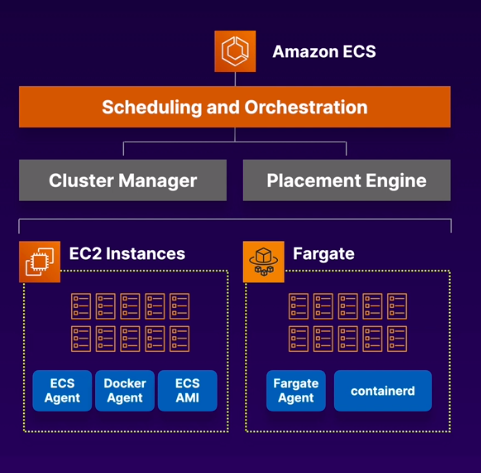

# 2.1 Identify elastic and scalable compute solutions for a workload

* [Elastic Cloud Compute (EC2)](ec2)

* [EC2 Auto Scaling](ec2-auto-scaling)

* AWS Batch: AWS Batch enables you to run batch computing workloads on the AWS Cloud.

* Amazon Elastic Container Service (ECS): Amazon Elastic Container Service (Amazon ECS) is a highly scalable, fast, container management service that makes it easy to run, stop, and manage Docker containers on a cluster. You can host your cluster on a serverless infrastructure that is managed by Amazon ECS by launching your services or tasks using the Fargate launch type. For more control over your infrastructure, you can host your tasks on a cluster of Amazon Elastic Compute Cloud (Amazon EC2) instances that you manage by using the EC2 launch type.

**note**: A Cloud Guru

* Amazon Elastic Kubernetes Service (EKS): Amazon EKS is a managed service that makes it easy for you to run Kubernetes on AWS without needing to install, operate, and maintain your own Kubernetes control plane or nodes. Kubernetes is an open-source system for automating the deployment, scaling, and management of containerized applications.

* Amazon Elastic MapReduce (EMR): Amazon EMR is a managed cluster platform that simplifies running big data frameworks, such as Apache Hadoop and Apache Spark, on AWS to process and analyze vast amounts of data.

**note**: A Cloud Guru: Master, Core (task and data), Task nodes (optional task only). Log on Master (can be configured at start to replicate to S3)

* Amazon Elastic Container Registry (Amazon ECR) is a managed AWS Docker registry service that is secure, scalable, and reliable. Amazon ECR supports private Docker repositories with resource-based permissions using AWS IAM so that specific users or Amazon EC2 instances can access repositories and images. Developers can use the Docker CLI to push, pull, and manage images.
