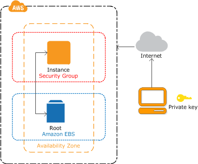

# Elastic Cloud Computer (EC2)

## Concepts

### Overview

> Amazon Elastic Compute Cloud (Amazon EC2) provides scalable computing capacity in the Amazon Web Services (AWS) cloud. Using Amazon EC2 eliminates your need to invest in hardware up front, so you can develop and deploy applications faster. You can use Amazon EC2 to launch as many or as few virtual servers as you need, configure security and networking, and manage storage. Amazon EC2 enables you to scale up or down to handle changes in requirements or spikes in popularity, reducing your need to forecast traffic.

-AWS-[What is Amazon EC2](https://docs.aws.amazon.com/AWSEC2/latest/UserGuide/concepts.html)

### Key Pair

> AWS uses public-key cryptography to secure the login information for your instance. A Linux instance has no password; you use a key pair to log in to your instance securely. You specify the name of the key pair when you launch your instance, then provide the private key when you log in using SSH.

-AWS-[Setting up with Amazon EC2](https://docs.aws.amazon.com/AWSEC2/latest/UserGuide/get-set-up-for-amazon-ec2.html)

### Security Group

> Security groups act as a firewall for associated instances, controlling both inbound and outbound traffic at the instance level. You must add rules to a security group that enable you to connect to your instance from your IP address using SSH. You can also add rules that allow inbound and outbound HTTP and HTTPS access from anywhere.

-AWS-[Setting up with Amazon EC2](https://docs.aws.amazon.com/AWSEC2/latest/UserGuide/get-set-up-for-amazon-ec2.html)



-AWS-[Getting started with Amazon EC2 Linux instances](https://docs.aws.amazon.com/AWSEC2/latest/UserGuide/EC2_GetStarted.html)

**note:** A Cloud Guru: Stateful FW with only ALLOW, Default SG, block all inbound. Wizard created opens up port 22 to world inbound. Default is open outbound. Many to many relationship to resources.

### Pricing

> On-Demand: With On-Demand instances, you pay for compute capacity by the hour or the second depending on which instances you run.

&nbsp;

> Spot-Instance: Amazon EC2 Spot instances allow you to request spare Amazon EC2 computing capacity for up to 90% off the On-Demand price

**note**: A Cloud Guru - Charged for hour if you terminate.

&nbsp;

> Savings Plans: Savings Plans are a flexible pricing model that offer low prices on EC2 and Fargate usage, in exchange for a commitment to a consistent amount of usage (measured in $/hour) for a 1 or 3 year term.

&nbsp;

> Reserved Instances: Reserved Instances provide you with a significant discount (up to 75%) compared to On-Demand instance pricing. In addition, when Reserved Instances are assigned to a specific Availability Zone, they provide a capacity reservation, giving you additional confidence in your ability to launch instances when you need them.

&nbsp;

> Dedicated Host: A Dedicated Host is a physical EC2 server dedicated for your use. Dedicated Hosts can help you reduce costs by allowing you to use your existing server-bound software licenses, including Windows Server, SQL Server, and SUSE Linux Enterprise Server (subject to your license terms), and can also help you meet compliance requirements

-AWS-[Amazon EC2 Pricing](https://aws.amazon.com/ec2/pricing/)

> EC2 usage is calculated by either the hour or the second, depending on which AMI you're running.

&nbsp;

> When reviewing your EC2 usage, consider the following:

&nbsp;

> If your instance is billed by the hour, then you're billed for a minimum of one hour each time a new instance is started—that is, when it enters the running state.

&nbsp;

> If your instance is billed by the second, then you're billed for a minimum of 60 seconds each time a new instance is started—that is, when it enters the running state.

&nbsp;

> Instances that are in any other state aren't billed.

-AWS-[How are EC2 instance-hours billed?](https://aws.amazon.com/premiumsupport/knowledge-center/ec2-instance-hour-billing/)

### AMI Properties

> Linux Amazon Machine Images use one of two types of virtualization: paravirtual (PV) or hardware virtual machine (HVM). The main differences between PV and HVM AMIs are the way in which they boot and whether they can take advantage of special hardware extensions (CPU, network, and storage) for better performance.

&nbsp;

> For the best performance, we recommend that you use current generation instance types and HVM AMIs when you launch your instances.

-AWS-[Linux AMI virtualization types](https://docs.aws.amazon.com/AWSEC2/latest/UserGuide/virtualization_types.html)

> When you launch an instance, the root device volume contains the image used to boot the instance. When we introduced Amazon EC2, all AMIs were backed by Amazon EC2 instance store, which means the root device for an instance launched from the AMI is an instance store volume created from a template stored in Amazon S3. After we introduced Amazon EBS, we introduced AMIs that are backed by Amazon EBS. This means that the root device for an instance launched from the AMI is an Amazon EBS volume created from an Amazon EBS snapshot.

**note:** A Cloud Guru: EBS must be in same AZ

> You can choose between AMIs backed by Amazon EC2 instance store and AMIs backed by Amazon EBS. We recommend that you use AMIs backed by Amazon EBS, because they launch faster and use persistent storage.

-AWS-[Amazon EC2 root device volume](https://docs.aws.amazon.com/AWSEC2/latest/UserGuide/RootDeviceStorage.html)

**note:** A Cloud Guru: Instance store backed EC2 cannot be stopped; so if underlying HW fails, you are screwed (ephemeral).

### Monitoring

> System status checks – monitor the AWS systems required to use your instance to ensure that they are working properly. These checks detect problems with your instance that require AWS involvement to repair.

&nbsp;

> Instance status checks – monitor the software and network configuration of your individual instance. These checks detect problems that require your involvement to repair.

&nbsp;

> Amazon CloudWatch alarms – watch a single metric over a time period you specify, and perform one or more actions based on the value of the metric relative to a given threshold over a number of time periods.

-AWS-[Automated and manual monitoring](https://docs.aws.amazon.com/AWSEC2/latest/UserGuide/monitoring_automated_manual.html)

> By default, Amazon EC2 sends metric data to CloudWatch in 5-minute periods. To send metric data for your instance to CloudWatch in 1-minute periods, you can enable detailed monitoring on the instance.

-AWS-[Monitoring your instances using CloudWatch](https://docs.aws.amazon.com/AWSEC2/latest/UserGuide/using-cloudwatch.html)

**note:** Collecting more system-level metrics, e.g., memory and disk utilization, and logs requires installing and configuring the CloudWatch Agent.

### Tagging

> A tag is a label that you assign to an AWS resource. Each tag consists of a key and an optional value, both of which you define.

&nbsp;

Tags enable you to categorize your AWS resources in different ways, for example, by purpose, owner, or environment. This is useful when you have many resources of the same type—you can quickly identify a specific resource based on the tags you've assigned to it. For example, you could define a set of tags for your account's Amazon EC2 instances that helps you track each instance's owner and stack level.

-AWS-[Tagging your Amazon EC2 resources](https://docs.aws.amazon.com/AWSEC2/latest/UserGuide/Using_Tags.html)

### Elastic IP

> An Elastic IP address is a static IPv4 address designed for dynamic cloud computing. An Elastic IP address is associated with your AWS account. With an Elastic IP address, you can mask the failure of an instance or software by rapidly remapping the address to another instance in your account.

-AWS-[Elastic IP addresses](https://docs.aws.amazon.com/AWSEC2/latest/UserGuide/elastic-ip-addresses-eip.html)

### Instance Metadata

> Instance metadata is data about your instance that you can use to configure or manage the running instance. Instance metadata is divided into categories, for example, host name, events, and security groups.

-AWS-[Instance metadata and user data](https://docs.aws.amazon.com/AWSEC2/latest/UserGuide/ec2-instance-metadata.html)

### Instance User Data

> User data must be base64-encoded. The Amazon EC2 console can perform the base64-encoding for you or accept base64-encoded input.

&nbsp;

> User data is limited to 16 KB, in raw form, before it is base64-encoded. The size of a string of length n after base64-encoding is ceil(n/3)*4.

&nbsp;

> If you stop an instance, modify its user data, and start the instance, the updated user data is not executed when you start the instance.

-AWS-[Working with instance user data](https://docs.aws.amazon.com/AWSEC2/latest/UserGuide/instancedata-add-user-data.html)

### Instance Type

> As your needs change, you might find that your instance is over-utilized (the instance type is too small) or under-utilized (the instance type is too large). If this is the case, you can change the size of your instance. For example, if your t2.micro instance is too small for its workload, you can change it to another instance type that is appropriate for the workload.

-AWS-[Changing the instance type](https://docs.aws.amazon.com/AWSEC2/latest/UserGuide/ec2-instance-resize.html)

### Custom AMI

> First, launch an instance from an AMI that's similar to the AMI that you'd like to create. You can connect to your instance and customize it. When the instance is configured correctly, ensure data integrity by stopping the instance before you create an AMI, then create the image. 

&nbsp;

> During the AMI-creation process, Amazon EC2 creates snapshots of your instance's root volume and any other EBS volumes attached to your instance. You're charged for the snapshots until you deregister the AMI and delete the snapshots.

&nbsp;

> If you have a snapshot of the root device volume of an instance, you can create an AMI from this snapshot using the AWS Management Console or the command line.

-AWS-[Creating an Amazon EBS-backed Linux AMI](https://docs.aws.amazon.com/AWSEC2/latest/UserGuide/creating-an-ami-ebs.html)

> You can copy an Amazon Machine Image (AMI) within or across AWS Regions using the AWS Management Console, the AWS Command Line Interface or SDKs, or the Amazon EC2 API, all of which support the CopyImage action. You can copy both Amazon EBS-backed AMIs and instance-store-backed AMIs. You can copy AMIs with encrypted snapshots and also change encryption status during the copy process.

-AWS-[Copying an AMI](https://docs.aws.amazon.com/AWSEC2/latest/UserGuide/CopyingAMIs.html)

**note:** Cannot share encrypted snapshots with other accounts.

### Service Quota

> Amazon EC2 provides different resources that you can use. These resources include images, instances, volumes, and snapshots. When you create your AWS account, we set default quotas (also referred to as limits) on these resources on a per-Region basis. For example, there is a limit on the number of instances that you can launch in a Region. Therefore, when you launch an instance in the US West (Oregon) Region, the request must not cause your usage to exceed your current instance limit in that Region.

&nbsp;

> The Amazon EC2 console provides limit information for the resources managed by the Amazon EC2 and Amazon VPC consoles. You can request an increase for many of these limits. Use the limit information that we provide to manage your AWS infrastructure. Plan to request any limit increases in advance of the time that you'll need them.

-AWS-[Amazon EC2 Service Quotas](https://docs.aws.amazon.com/AWSEC2/latest/UserGuide/ec2-resource-limits.html)

> If you get an InstanceLimitExceeded error when you try to launch a new instance or restart a stopped instance, you have reached the limit on the number of instances that you can launch in a Region. When you create your AWS account, we set default limits on the number of instances you can run on a per-Region basis.

&nbsp;

> If you get an InsufficientInstanceCapacity error when you try to launch an instance or restart a stopped instance, AWS does not currently have enough available On-Demand capacity to service your request.

-AWS-[Troubleshooting instance launch issues](https://docs.aws.amazon.com/AWSEC2/latest/UserGuide/troubleshooting-launch.html#troubleshooting-launch-capacity)

### Placement Groups

> When you launch a new EC2 instance, the EC2 service attempts to place the instance in such a way that all of your instances are spread out across underlying hardware to minimize correlated failures. You can use placement groups to influence the placement of a group of interdependent instances to meet the needs of your workload. Depending on the type of workload, you can create a placement group using one of the following placement strategies:

* Cluster – packs instances close together inside an Availability Zone. This strategy enables workloads to achieve the low-latency network performance necessary for tightly-coupled node-to-node communication that is typical of HPC applications.

* Partition – spreads your instances across logical partitions such that groups of instances in one partition do not share the underlying hardware with groups of instances in different partitions. This strategy is typically used by large distributed and replicated workloads, such as Hadoop, Cassandra, and Kafka.

* Spread – strictly places a small group of instances across distinct underlying hardware to reduce correlated failures.

-AWS-[Placement groups](https://docs.aws.amazon.com/AWSEC2/latest/UserGuide/placement-groups.html)

### Network Interfaces

> Every instance in a VPC has a default network interface, called the primary network interface. You cannot detach a primary network interface from an instance. You can create and attach additional network interfaces.

&nbsp;

> You can create a management network using network interfaces. In this scenario, the primary network interface (eth0) on the instance handles public traffic and the secondary network interface (eth1) handles backend management traffic and is connected to a separate subnet in your VPC that has more restrictive access controls.

-AWS-[Elastic network interfaces](https://docs.aws.amazon.com/AWSEC2/latest/UserGuide/using-eni.html)

> A requester-managed network interface is a network interface that an AWS service creates in your VPC. This network interface can represent an instance for another service, such as an Amazon RDS instance, or it can enable you to access another service or resource, such as an AWS PrivateLink service, or an Amazon ECS task.

-AWS-[Requester-managed network interfaces](https://docs.aws.amazon.com/AWSEC2/latest/UserGuide/requester-managed-eni.html)

> Depending on your instance type, enhanced networking can be enabled using one of the following mechanisms:

* The Elastic Network Adapter (ENA) supports network speeds of up to 100 Gbps for supported instance types.

* The Intel 82599 Virtual Function interface supports network speeds of up to 10 Gbps for supported instance types.

-AWS-[Enhanced networking on Linux](https://docs.aws.amazon.com/AWSEC2/latest/UserGuide/enhanced-networking.html)

> An Elastic Fabric Adapter (EFA) is a network device that you can attach to your Amazon EC2 instance to accelerate High Performance Computing (HPC) and machine learning applications.

-AWS-[Elastic Fabric Adapter](https://docs.aws.amazon.com/AWSEC2/latest/UserGuide/efa.html)

### Spot Instances

> Spot Instance request – Requests a Spot Instance. The request provides the maximum price per hour that you are willing to pay for a Spot Instance. If you don't specify a maximum price, the default maximum price is the On-Demand price. When the maximum price per hour for your request exceeds the Spot price, Amazon EC2 fulfills your request if capacity is available. A Spot Instance request is either one-time or persistent. Amazon EC2 automatically resubmits a persistent Spot Instance request after the Spot Instance associated with the request is terminated. Your Spot Instance request can optionally specify a duration for the Spot Instances.

&nbsp;

> Spot Fleet – A set of Spot Instances that is launched based on criteria that you specify. The Spot Fleet selects the Spot Instance pools that meet your needs and launches Spot Instances to meet the target capacity for the fleet. By default, Spot Fleets are set to maintain target capacity by launching replacement instances after Spot Instances in the fleet are terminated. You can submit a Spot Fleet as a one-time request, which does not persist after the instances have been terminated. You can include On-Demand Instance requests in a Spot Fleet request.

&nbsp;

> Another strategy is to launch Spot Instances with a specified duration (also known as Spot blocks), which are designed not to be interrupted and will run continuously for the duration you select. In rare situations, Spot blocks may be interrupted due to Amazon EC2 capacity needs. In these cases, we provide a two-minute warning before we terminate an instance, and you are not charged for the terminated instances even if you used them.

&nbsp;

## Exercises

### Create Key Pair

1. Create a Key Pair in a Region

Properties:

* Name: *my-key-pair*

### Create Security Group

1. Create a security group in default VPC in a Region

Properties:

* Enable Inbound SSH from *0.0.0.0/0*

* Name: *my-security-group*

### Create EC2 Instance

1. Create an EC2 instance in default Subnet in default VPC in a Region

Properties:

* AMI: *Amazon Linux 2 AMI (HVM), SSD Volume Type*

* Type: *t2-micro*

* Security Group: *my-security-group*
:
* Key Pair: *my-key-pair*

* Name: *my-ec2*

#### Supplemental Tasks

1. Observe AMI virtualization type: *HVM*

2. Observe root volume type: *EBS*

3. Observe EBS volume is marked by default: *Delete on termination*

4. Login and update instance packages

5. Stop instance

### Create EC2 Spot Instance

1. Same as Create EC2 Instance except Name: *my-spot-ec2*

**note**: Tried multiple regions; repeatedly got error trying to launch.

#### Supplemental Tasks

1. Observe price difference between On-Demand and Spot pricing

2. Teminate instance

### Monitor EC2 Instance

1. Start *my-ec2* instance

2. Observe System and Instance Status Checks

3. Create Alarm *my-alarm* to *my-topic* Topic if CPU average is at 50% for 5 minute

4. Install *stress* CLI tool; requires enabling EPEL repo in Linux 2 AMI

5. Using *stress* CLI, stress CPU for 5 minutes; observe alarm

#### Supplemental Tasks

1. Observe no memory or disk utilization metrics

2. Stop *my-ec2* instance

### Add Tag to Instance

1. Add Tag to *my-ec2* Instance

Properties:

* Tag: *my-tag*

* Value: *my-value*

### Associate Elastic IP Address

1. Allocate Elastic IP Address

2. Associate Elastic IP Address to *my-ec2* instance

#### Supplemental Tasks

1. Disassociate Elastic IP Address from *my-ec2* instance

2. Deallocate Elastic IP Address

### Explore Instance Metadata

1. Start *my-ec2* instance

2. Retrieve public DNS name using IMDSv1, e.g., `curl http://169.254.169.254/latest/meta-data/public-hostname`

#### Supplemental Tasks

1. Stop *my-ec2* instance

### Create EC2 Instance with User Data

1. Update *my-security-group* to enable inbound HTTP

2. Create new instance much the same as *my-ec2*; exceptions below

3. Observe system log

4. Browse public IP address

Properties:

* Name: *my-user-data-ec2*

* User Data:

```plaintext
#!/bin/bash -xe
exec > >(tee /var/log/user-data.log|logger -t user-data -s 2>/dev/console) 2>&1
  yum update -y
  yum install httpd -y
  systemctl enable httpd
  systemctl start httpd
```

#### Supplemental Tasks

1. Terminate *my-user-data-ec2* instance

### Change Instance Type

1. Change instance type of *my-ec2*

Properties:

Type: *t2-small*

#### Supplemental Tasks

1. Observe that one cannot change Instance Type if Instance is running

### Create Custom AMI

1. Create AMI from *my-ec2* EC2 Instance in Region

Properties:

* Name: *my-ami*

#### Supplemental Tasks

1. Observe that while one can create an AMI when Instance is running, it is not recommended

2. Create and terminate EC2 Instance using *my-ami* AMI

3. Terminate *my-ec2* EC2 Instance

### Copy an AMI

1. Copy *my-ami* AMI to a different Region

#### Supplemental Tasks

1. Deregister *my-ami* AMI

2. Delete Snapshot backing *my-ami* AMI

### Review Service Quota

1. Review Service Quota for Region
