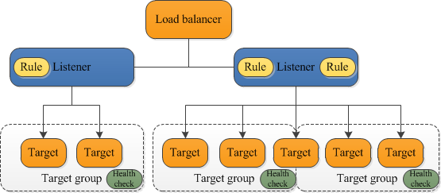

# Elastic Load Balancing

## Concepts

### Overview

> Elastic Load Balancing supports three types of load balancers: Application Load Balancers, Network Load Balancers, and Classic Load Balancers.

&nbsp;

> An Application Load Balancer functions at the application layer, the seventh layer of the Open Systems Interconnection (OSI) model. After the load balancer receives a request, it evaluates the listener rules in priority order to determine which rule to apply, and then selects a target from the target group for the rule action.

-AWS-[What Is an Application Load Balancer?](https://docs.aws.amazon.com/elasticloadbalancing/latest/application/introduction.html)

> A Network Load Balancer functions at the fourth layer of the Open Systems Interconnection (OSI) model. It can handle millions of requests per second. After the load balancer receives a connection request, it selects a target from the target group for the default rule. It attempts to open a TCP connection to the selected target on the port specified in the listener configuration.

-AWS-[What Is a Network Load Balancer?](https://docs.aws.amazon.com/elasticloadbalancing/latest/network/introduction.html)

> Using a Classic Load Balancer instead of an Application Load Balancer has the following benefits:

&nbsp;

> Support for EC2-Classic

&nbsp;

> Support for TCP and SSL listeners

&nbsp;

> Support for sticky sessions using application-generated cookies

-AWS-[What Is a Classic Load Balancer?](https://docs.aws.amazon.com/elasticloadbalancing/latest/classic/introduction.html)

> Application Load Balancers and Classic Load Balancers add X-Forwarded-For, X-Forwarded-Proto, and X-Forwarded-Port headers to the request.

-AWS-[How Elastic Load Balancing works](https://docs.aws.amazon.com/elasticloadbalancing/latest/userguide/how-elastic-load-balancing-works.html)

> The nodes for your load balancer distribute requests from clients to registered targets. When cross-zone load balancing is enabled, each load balancer node distributes traffic across the registered targets in all enabled Availability Zones. When cross-zone load balancing is disabled, each load balancer node distributes traffic only across the registered targets in its Availability Zone.

&nbsp;

> With Application Load Balancers, cross-zone load balancing is always enabled.

-AWS-[How Elastic Load Balancing works](https://docs.aws.amazon.com/elasticloadbalancing/latest/userguide/how-elastic-load-balancing-works.html)

> Amazon ELB is able to handle the vast majority of use cases for our customers without requiring "pre-warming" (configuring the load balancer to have the appropriate level of capacity based on expected traffic). In certain scenarios, such as when flash traffic is expected, or in the case where a load test cannot be configured to gradually increase traffic, we recommend that you contact us to have your load balancer "pre-warmed". We will then configure the load balancer to have the appropriate level of capacity based on the traffic that you expect. We will need to know the start and end dates of your tests or expected flash traffic, the expected request rate per second and the total size of the typical request/response that you will be testing.

-AWS-[White Paper](https://aws.amazon.com/elasticloadbalancing/resources/)

### Application Load Balancer

> A load balancer serves as the single point of contact for clients. The load balancer distributes incoming application traffic across multiple targets, such as EC2 instances, in multiple Availability Zones. This increases the availability of your application. You add one or more listeners to your load balancer.

&nbsp;

> A listener checks for connection requests from clients, using the protocol and port that you configure. The rules that you define for a listener determine how the load balancer routes requests to its registered targets. Each rule consists of a priority, one or more actions, and one or more conditions. When the conditions for a rule are met, then its actions are performed. You must define a default rule for each listener, and you can optionally define additional rules.

&nbsp;

> Each target group routes requests to one or more registered targets, such as EC2 instances, using the protocol and port number that you specify. You can register a target with multiple target groups. You can configure health checks on a per target group basis. Health checks are performed on all targets registered to a target group that is specified in a listener rule for your load balancer.

-AWS-[What Is an Application Load Balancer?](https://docs.aws.amazon.com/elasticloadbalancing/latest/application/introduction.html)

### Misc

> HTTP 503: Service unavailable: The target groups for the load balancer have no registered targets.

&nbsp;

> HTTP 504: Gateway timeout: The load balancer failed to establish a connection to the target before the connection timeout expired (10 seconds). etc...

-AWS-[Troubleshoot your Application Load Balancers](https://docs.aws.amazon.com/elasticloadbalancing/latest/application/load-balancer-troubleshooting.html)

> Elastic Load Balancing publishes data points to Amazon CloudWatch for your load balancers and your back-end instances. CloudWatch enables you to retrieve statistics about those data points as an ordered set of time-series data, known as metrics. 

* BackendConnectionErrors

* HealthyHostCount

* HTTPCode_Backend_2XX, HTTPCode_Backend_3XX, HTTPCode_Backend_4XX, HTTPCode_Backend_5XX

* Latency

* RequestCount

* SpilloverCount (Classic Only; request rejecting)

* SurgeQueueLength (Classic Only; Pending Requests; Queue 1024)

* UnHealthyHostCount

-AWS-[CloudWatch metrics for your Classic Load Balancer](https://docs.aws.amazon.com/elasticloadbalancing/latest/classic/elb-cloudwatch-metrics.html)

**note:** A Cloud Guru, Application LB can route based on hostname, paths.

> A launch template is similar to a launch configuration, in that it specifies instance configuration information. Included are the ID of the Amazon Machine Image (AMI), the instance type, a key pair, security groups, and the other parameters that you use to launch EC2 instances. However, defining a launch template instead of a launch configuration allows you to have multiple versions of a template. 

-AWS-[Launch Templates](https://docs.aws.amazon.com/autoscaling/ec2/userguide/LaunchTemplates.html)

### Network Load Balancer

> Source IP preservation: If you specify targets using an instance ID, the source IP addresses of the clients are preserved and provided to your applications.

### Application Load Balancer

Can use WAF.

> You can use request tracing to track HTTP requests from clients to targets or other services. When the load balancer receives a request from a client, it adds or updates the X-Amzn-Trace-Id header before sending the request to the target. Any services or applications between the load balancer and the target can also add or update this header.

### Access Logs

> Elastic Load Balancing provides access logs that capture detailed information about requests sent to your load balancer. Each log contains information such as the time the request was received, the client's IP address, latencies, request paths, and server responses.

&nbsp;

> Access logging is an optional feature of Elastic Load Balancing that is disabled by default. After you enable access logging for your load balancer, Elastic Load Balancing captures the logs and stores them in the Amazon S3 bucket that you specify as compressed files.

&nbsp;

> Each access log file is automatically encrypted using SSE-S3 before it is stored in your S3 bucket and decrypted when you access it.

**note:** A Cloud Guru; Access Logs are good because they are more permanent than the logs in the EC2 instances (ephemeral)

### Error Messages

**note:** A Cloud Guru

* 400: malformed

* 401: unauthorized

* 403: forbidden, e.g. WAF

* 460: Client timeout

* 463: Bad X-Forwarded-For

* 500: ELB error

* 502: Bad Gateway: Target sent bad response

* 503: No registered targets

* 504: Gateway Timeout: Target timeout

* 561: Unauthorized

### MISC

To ensure that a Classic Load Balancer stops sending requests to instances that are de-registering or unhealthy, while keeping the existing connections open, use connection draining. This enables the load balancer to complete in-flight requests made to instances that are de-registering or unhealthy.

When you enable connection draining, you can specify a maximum time for the load balancer to keep connections alive before reporting the instance as de-registered. The maximum timeout value can be set between 1 and 3,600 seconds (the default is 300 seconds). When the maximum time limit is reached, the load balancer forcibly closes connections to the de-registering instance.

## Exercises

### Create Target Group

#### Assumptions

Understand material in [EC2 Auto Scaling](../../2.1/ec2-auto-scaling) and completed exercises:

* Create Launch Template [EC2 Auto Scaling](../../2.1/ec2-auto-scaling)

* Create Auto Scaling Group [EC2 Auto Scaling](../../2.1/ec2-auto-scaling)

Except here install / enable *httpd* package / service instead of *stress* and manually set Auto Scaling ground with desired / minimum / maximum capacities at 3 / 3 / 3.

**note**: Also you need to create some HTML content in the file */var/www/http/index.html*.

**note**: Make sure the *my-security-group* Security Group allows HTTP inbound

#### Steps

1. Create Target Group; properties below

Properties

* Target Type: Instances

* Name: *my-target-group*

* Register Targets: Existing EC2 instances from *my-as-group*

### Create Application Load Balancer

1. Create Application Load Balancer; properties below

Properties

* Type: Application Load Balancer

* Name: *my-alb*

* Availability Zones: Same as for Auto Scaling Group

* Security Group: *my-security-group*

* Target Group: *my-target-group*

#### Supplemental Tasks

1. Validate can browse to Application Load Balancer DNS name

2. Edit *my-as-group* Auto Scaling Group; set its Target Group to *my-target-group*

3. Delete *my-alb* Application Load Balancer

4. Delete *my-target-group* Target Group

5. Delete *my-as-group* Auto Scaling Group

6. Delete *my-launch-template* Launch Template

7. Delete *my-ami* AMI

8. Delete Snapshot backing *my-ami*
