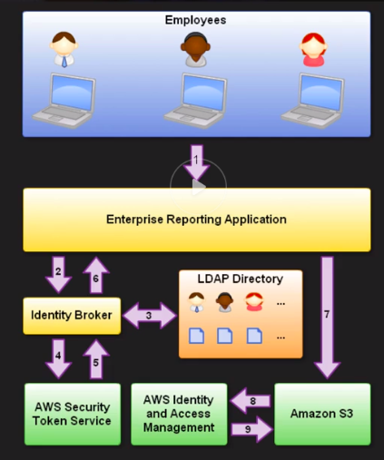
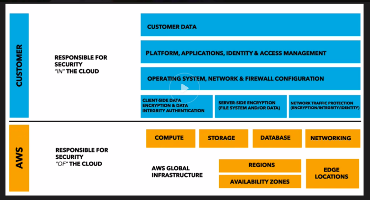

# 3.1 Design secure access to AWS resources

* [AWS Identity Access Management (IAM)](iam)

* [AWS Config](config)

* [AWS CloudTrail](cloudtrail)

* [AWS Organizations](organizations)

* [AWS Control Tower](control-tower)

* AWS Single Sign-On

> AWS Single Sign-On is a cloud-based single sign-on (SSO) service that makes it easy to centrally manage SSO access to all of your AWS accounts and cloud applications. Specifically, it helps you manage SSO access and user permissions across all your AWS accounts in AWS Organizations. AWS SSO also helps you manage access and permissions to commonly used third-party software as a service (SaaS) applications, AWS SSO-integrated applications as well as custom applications that support Security Assertion Markup Language (SAML) 2.0

[What Is AWS Single Sign-On?](https://docs.aws.amazon.com/singlesignon/latest/userguide/what-is.html)

> AWS Directory Service provides multiple ways to use Microsoft Active Directory (AD) with other AWS services. Directories store information about users, groups, and devices, and administrators use them to manage access to information and resources. AWS Directory Service provides multiple directory choices for customers who want to use existing Microsoft AD or Lightweight Directory Access Protocol (LDAP)–aware applications in the cloud. It also offers those same choices to developers who need a directory to manage users, groups, devices, and access.

[What Is AWS Directory Service?](https://docs.aws.amazon.com/directoryservice/latest/admin-guide/what_is.html)

**notes**: A Cloud Guru:

* AWS Managed Microsoft AD: AD Controllers with AD trust

* Simple AD (small or large): AD Controllers without AD trust

* AD Connector: Connecting on-premise services using AD

> Amazon Cloud Directory is a highly available multi-tenant directory-based store in AWS. These directories scale automatically to hundreds of millions of objects as needed for applications. This lets operation's staff focus on developing and deploying applications that drive the business, not managing directory infrastructure. Unlike traditional directory systems, Cloud Directory does not limit organizing directory objects in a single fixed hierarchy.

&nbsp;

> A user pool is a user directory in Amazon Cognito. With a user pool, your users can sign in to your web or mobile app through Amazon Cognito. Your users can also sign in through social identity providers like Google, Facebook, Amazon, or Apple, and through SAML identity providers. Whether your users sign in directly or through a third party, all members of the user pool have a directory profile that you can access through a Software Development Kit (SDK).

&nbsp;

> AWS Resource Access Manager (AWS RAM) lets you share your resources with any AWS account or through AWS Organizations. If you have multiple AWS accounts, you can create resources centrally and use AWS RAM to share those resources with other accounts.

**note:** A Cloud Guru, normal flow is to share and then accept.  Can bypass if using AWS organizations.

* Identity Providers and Federation:

If you already manage user identities outside of AWS, you can use IAM identity providers instead of creating IAM users in your AWS account. With an identity provider (IdP), you can manage your user identities outside of AWS and give these external user identities permissions to use AWS resources in your account. This is useful if your organization already has its own identity system, such as a corporate user directory. It is also useful if you are creating a mobile app or web application that requires access to AWS resources.

When you use an IAM identity provider, you don't have to create custom sign-in code or manage your own user identities. The IdP provides that for you. Your external users sign in through a well-known IdP, such as Login with Amazon, Facebook, or Google. You can give those external identities permissions to use AWS resources in your account. IAM identity providers help keep your AWS account secure because you don't have to distribute or embed long-term security credentials, such as access keys, in your application.

To use an IdP, you create an IAM identity provider entity to establish a trust relationship between your AWS account and the IdP. IAM supports IdPs that are compatible with OpenID Connect (OIDC) or SAML 2.0 (Security Assertion Markup Language 2.0). For more information about using one of these IdPs with AWS, see the following sections:

**note:** From my Medium article, can then create Roles that can be assumed by identities in the IDP.

Amazon Cognito Identity Pools (Federated Identities): Amazon Cognito identity pools (federated identities) enable you to create unique identities for your users and federate them with identity providers. With an identity pool, you can obtain temporary, limited-privilege AWS credentials to access other AWS services.

**note:** From my experience.  Basically automates the selection of IAM Roles. Can also be used to store data for identities and be pushed to mobile.

* AWS Security Token Service (AWS STS) is a web service that enables you to request temporary, limited-privilege credentials for AWS Identity and Access Management (IAM) users or for users that you authenticate (federated users).

When an administrator creates a role for cross-account access they establish trust between the account that owns the role and the resources (trusting account) and the account that contains the users (trusted account). To do this, the administrator of the trusting account specifies the trusted account number as the Principal in the role's trust policy. That allows potentially any user in the trusted account to assume the role. To complete the configuration, the administrator of the trusted account must give specific groups or users in that account permission to switch to the role.

A policy that grants a user permission to assume a role must include a statement with the Allow effect on the following:

The sts:AssumeRole action

The Amazon Resource Name (ARN) of the role in a Resource element

Can use Switch Role in AWS Console to switch to a role (can be in a different account). The Role needs a trust policy that allows user to assume role.

By default, when you switch roles, your AWS Management Console session lasts for 1 hour. IAM user sessions are 12 hours by default. IAM users who switch roles in the console are granted the role maximum session duration, or the remaining time in the IAM user's session, whichever is less.

**note:** A Cloud Guru

**note:** A Cloud Guru; shared security model

Boundary is different for Instructure, Container, and Abstracted

* AWS Artifact provides on-demand downloads of AWS security and compliance documents, such as AWS ISO certifications, Payment Card Industry (PCI), and Service Organization Control (SOC) reports. You can submit the security and compliance documents (also known as audit artifacts) to your auditors or regulators to demonstrate the security and compliance of the AWS infrastructure and services that you use. You can also use these documents as guidelines to evaluate your own cloud architecture and assess the effectiveness of your company's internal controls. AWS Artifact provides documents about AWS only. AWS customers are responsible for developing or obtaining documents that demonstrate the security and compliance of their companies.
