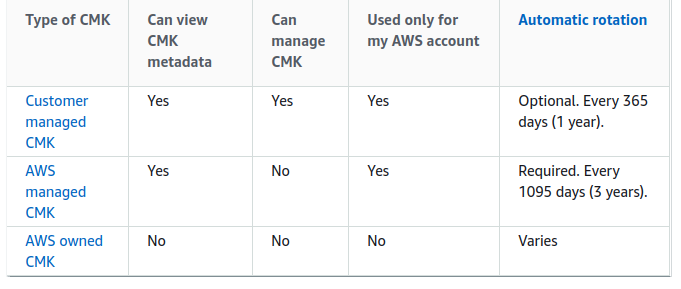

# AWS Key Management Service (KMS)

## Concepts

> AWS Key Management Service (AWS KMS) is a managed service that makes it easy for you to create and control customer master keys (CMKs), the encryption keys used to encrypt your data. AWS KMS CMKs are protected by hardware security modules (HSMs) that are validated by the FIPS 140-2 Cryptographic Module Validation Program except in the China (Beijing) and China (Ningxia) Regions.

-AWS-[What is AWS Key Management Service?](https://docs.aws.amazon.com/kms/latest/developerguide/overview.html)

> AWS KMS supports symmetric and asymmetric CMKs. A symmetric CMK represents a 256-bit key that is used for encryption and decryption. An asymmetric CMK represents an RSA key pair that is used for encryption and decryption or signing and verification (but not both), or an elliptic curve (ECC) key pair that is used for signing and verification. 

&nbsp;

> CMKs are created in AWS KMS. Symmetric CMKs and the private keys of asymmetric CMKs never leave AWS KMS unencrypted. To manage your CMK, you can use the AWS Management Console or the AWS KMS API. To use a CMK in cryptographic operations, you must use the AWS KMS API. This strategy differs from data keys. AWS KMS does not store, manage, or track your data keys. You must use them outside of AWS KMS.

> Customer managed CMKs are CMKs in your AWS account that you create, own, and manage. You have full control over these CMKs...

&nbsp;

> AWS managed CMKs are CMKs in your account that are created, managed, and used on your behalf by an AWS service that is integrated with AWS KMS. Some AWS services support only an AWS managed CMK

&nbsp;

> AWS owned CMKs are a collection of CMKs that an AWS service owns and manages for use in multiple AWS accounts. Although AWS owned CMKs are not in your AWS account, an AWS service can use its AWS owned CMKs to protect the resources in your account.

&nbsp;

> Data keys are encryption keys that you can use to encrypt data, including large amounts of data and other data encryption keys.

&nbsp;

> You can use AWS KMS customer master keys (CMKs) to generate, encrypt, and decrypt data keys. However, AWS KMS does not store, manage, or track your data keys, or perform cryptographic operations with data keys. You must use and manage data keys outside of AWS KMS.

&nbsp;

> When you encrypt your data, your data is protected, but you have to protect your encryption key. One strategy is to encrypt it. Envelope encryption is the practice of encrypting plaintext data with a data key, and then encrypting the data key under another key.

&nbsp;

> All AWS KMS cryptographic operations with symmetric CMKs accept an encryption context, an optional set of key–value pairs that can contain additional contextual information about the data. AWS KMS uses the encryption context as additional authenticated data (AAD) to support authenticated encryption.

&nbsp;

> When you create a CMK, you determine who can use and manage that CMK. These permissions are contained in a document called the key policy. You can use the key policy to add, remove, or change permissions at any time for a customer managed CMK.

&nbsp;

> A grant is another mechanism for providing permissions. It's an alternative to key policies. Because grants can be very specific, and are easy to create and revoke, they are often used to provide temporary permissions or more granular permissions.

&nbsp;

> You can use AWS CloudTrail to audit key usage. CloudTrail creates log files that contain a history of AWS API calls and related events for your account. These log files include all AWS KMS API requests made with the AWS Management Console, AWS SDKs, and command line tools.

-AWS-[AWS Key Management Service concepts](https://docs.aws.amazon.com/kms/latest/developerguide/concepts.html)

> Cryptographic best practices discourage extensive reuse of encryption keys. To create new cryptographic material for your AWS Key Management Service (AWS KMS) customer master keys (CMKs), you can create new CMKs, and then change your applications or aliases to use the new CMKs. Or, you can enable automatic key rotation for an existing customer managed CMK.

&nbsp;

> When you enable automatic key rotation for a customer managed CMK, AWS KMS generates new cryptographic material for the CMK every year. AWS KMS also saves the CMK's older cryptographic material in perpetuity so it can be used to decrypt data that it encrypted. AWS KMS does not delete any rotated key material until you delete the CMK.

-AWS-[Rotating customer master keys](https://docs.aws.amazon.com/kms/latest/developerguide/rotate-keys.html)

> Much of the power of aliases come from your ability to change the CMK associated with an alias at any time. Aliases can make your code easier to write and maintain. For example, suppose you use an alias to refer to a particular CMK and you want to change the CMK. In that case, just associate the alias with a different CMK. You don't need to change your code.

-AWS-[Using aliases](https://docs.aws.amazon.com/kms/latest/developerguide/kms-alias.html)

> The default key policy gives the AWS account (root user) that owns the CMK full access to the CMK, which accomplishes the following two things.

&nbsp;

> The default key policy created by the console allows you to choose IAM users and roles in the account and make them key administrators. Key administrators have permissions to manage the CMK, but do not have permissions to use the CMK in cryptographic operations.

&nbsp;

> The default key policy that the console creates for symmetric CMKs allows you to choose IAM users and roles in the account, and external AWS accounts, and make them key users.

-AWS-[Using key policies in AWS KMS](https://docs.aws.amazon.com/kms/latest/developerguide/key-policies.html)

## Exercises

### Create and Use Symetric Key

1. Create Symeteric Key with alias

2. Use AWS CLI to encrypt string (have to base64 first)

3. Use AWS CLI to decrypt string

#### Suplemental Tasks

1. Schedule Key deletion in 7 days
