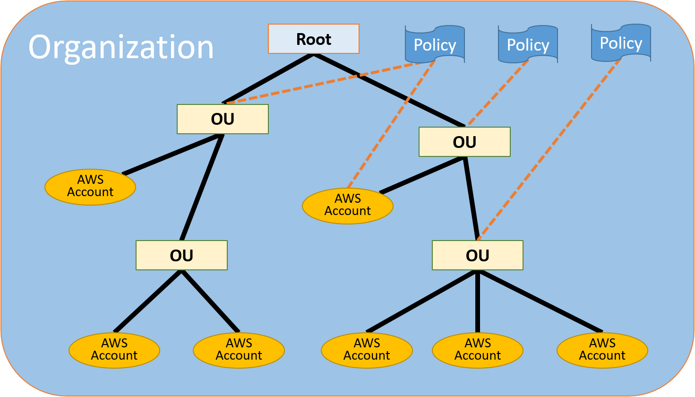

# AWS Organizations

## Concepts

> AWS Organizations is an account management service that enables you to consolidate multiple AWS accounts into an organization that you create and centrally manage. AWS Organizations includes account management and consolidated billing capabilities that enable you to better meet the budgetary, security, and compliance needs of your business. As an administrator of an organization, you can create accounts in your organization and invite existing accounts to join the organization.

&nbsp;

> AWS Organizations offers the following features:

* Centralized management of all of your AWS accounts

* Consolidated billing for all member accounts

* Hierarchical grouping of your accounts to meet your budgetary, security, or compliance needs

* Policies to centralize control over the AWS services and API actions that each account can access

* Policies to standardize tags across the resources in your organization's accounts

* Policies to control how AWS artificial intelligence (AI) and machine learning services can collect and store data.

* Integration and support for AWS Identity and Access Management (IAM)

* Integration with other AWS services

* Data replication that is eventually consistent

-AWS-[What is AWS Organizations?](https://docs.aws.amazon.com/organizations/latest/userguide/orgs_introduction.html)

>Organization: An entity that you create to consolidate your AWS accounts so that you can administer them as a single unit. You can use the AWS Organizations console to centrally view and manage all of your accounts within your organization. An organization has one master account along with zero or more member accounts. You can organize the accounts in a hierarchical, tree-like structure with a root at the top and organizational units nested under the root. Each account can be directly in the root, or placed in one of the OUs in the hierarchy.

&nbsp;

> There are two types of accounts in an organization: a single account that is designated as the master account, and member accounts.

&nbsp;

> Handshakes: A multi-step process of exchanging information between two parties... You generally need to directly interact with handshakes only if you work with the AWS Organizations API or command line tools such as the AWS CLI.

&nbsp;

> All features – The default feature set that is available to AWS Organizations. It includes all the functionality of consolidated billing, plus advanced features that give you more control over accounts in your organization.

&nbsp;

> Consolidated billing – This feature set provides shared billing functionality, but does not include the more advanced features of AWS Organizations.

&nbsp;

> Service control policy (SCP): A policy that specifies the services and actions that users and roles can use in the accounts that the SCP affects. SCPs are similar to IAM permissions policies except that they don't grant any permissions. Instead, SCPs specify the maximum permissions for an organization, organizational unit (OU), or account.

&nbsp;

> A type of policy that can help you standardize tags across resources in your organization's accounts. In a tag policy, you can specify tagging rules for specific resources.

&nbsp;

> Allow list strategy – You explicitly specify the access that is allowed. All other access is implicitly blocked. By default, AWS Organizations attaches an AWS managed policy called FullAWSAccess to all roots, OUs, and accounts. This ensures that, as you build your organization, nothing is blocked until you want it to be. In other words, by default all permissions are allowed. When you are ready to restrict permissions, you replace the FullAWSAccess policy with one that allows only the more limited, desired set of permissions.

&nbsp;

> Deny list strategy – You explicitly specify the access that is not allowed. All other access is allowed. In this scenario, all permissions are allowed unless explicitly blocked. This is the default behavior of AWS Organizations. By default, AWS Organizations attaches an AWS managed policy called FullAWSAccess to all roots, OUs, and accounts. This allows any account to access any service or operation with no AWS Organizations–imposed restrictions. Unlike the allow list technique described above, when using deny lists, you leave the default FullAWSAccess policy in place (that allow "all"). But then you attach additional policies that explicitly deny access to the unwanted services and actions.

-AWS-[AWS Organizations terminology and concepts](https://docs.aws.amazon.com/organizations/latest/userguide/orgs_getting-started_concepts.html)

> For Email, enter the email address of the individual who is to receive communications on behalf of the account. This value must be globally unique. No two accounts can have the same email address.

&nbsp;

> The master account isn't affected by any SCP, so after you apply the CloudTrail SCP, you must create any logs from the master account.

-AWS-Tutorial: [Creating and configuring an organization](https://docs.aws.amazon.com/organizations/latest/userguide/orgs_tutorials_basic.html)

**note**: A Cloud Guru:

* Publishing Account, e.g., Network

* Identity Account, replace by using SSO

* Logging Account, same as in AWS Control Tower

## Exercises

[Tutorial: Creating and configuring an organization](https://docs.aws.amazon.com/organizations/latest/userguide/orgs_tutorials_basic.html)
